# __Jungwoo Lee (이정우)__

Robot Software System Integration & AI Developer

<!-- <a href="mailto:ricow4439@gmail.com">ricow4439@gmail.com</a> | -->
<a href="https://www.linkedin.com/in/정우-이-486838395">LinkedIn</a>

## <b><u>Profile</u></b>

안녕하세요! 저는 소프트웨어 시스템 통합과, 로봇 인지와 행동 추론 등 다양한 분야에 대한 AI 모델을 만들고 있습니다. 

## <u>Skills</u>

#### Good knowledge
- Tensorflow, Torch, ROS
- From Scratch Model 구현(Transformer-based, Mamba-based)으로 여러 도메인 데이터(Image, Time-series, Text) 처리

#### Basic knowledge
- Open Weights Model에 대한 PEFT/SFT로 Fine-tuning
- Hardware (ST MCU, TI DSP), PLC (LSIS), OrCAD (Circuit Design)

#### Languages
- Python, C++, C#, Perl, Assembly (for debugging)

#### AI
- Claude, Codex, Gemini, Local LLM (MiniMax, GLM, GPT-OSS) for Coding Agent 

## <u>Experience</u>

`2007.11 - 현재` | 
__[한국로봇융합연구원(Korea Institute of Robotics and Technology Convergence)](https://www.kiro.re.kr)__, 책임연구원 (SI / AI Model Development)

`2004.11 - 2007.09` | 
__한국과학기술연구원 영상미디어연구센터(IMRC)__, 위촉연구원 (로봇 미들웨어 개발)

`2003.12 - 2004.06` | 
__삼성종합기술원 HCI Lab__, 위촉연구원 (하드웨어 개발)

## <u>Education</u>

`2020-2024` | 
__부경대학교 기계시스템공학 박사__  : "A Study on ROV Attitude Control and Marine Glider Detection for Glider Recovery Using a Deep Learning Model" (Ph.D. Dissertation)

`2013-2015` | 
__한국과학기술원 소프트웨어공학 석사__

`1999-2005` | 
__한양대학교 전자통신컴퓨터공학 학사__

## <u>Projects</u>

### 2026
- #### BOP (Benchmark for 6D Object Pose Estimation) : 2025 ~ 진행 중
  - HOPE (NVIDIA Household Objects for Pose Estimation) Dataset에 대한 6D-Pose + Object Size + ID 추정을 위한 모델 개발 (Tensorflow & Torch, from scratch)
  - Encoder-only Transformer (MoE는 layer 별 가변 experts) 설계 적용
  - Mamba-based Model 테스트 병행
  - 모델 입력은 카메라의 Depth -> Point Clouds, 모델 출력은 객체의 6D-Pose + Object Size + ID

- #### 수중 글라이더 탐지를 위한 3D 위치 추정 : 2025 ~ 2026
  - ROV 탑재된 Camera의 Color Image에서 수중 글라이더의 위치를 추정하는 모델 개선 (Tensorflow, from scratch)
  - Vision Encoder는 Hierarchical Convolutional Neural Network을 설계하고, 가변 MoE 구현 적용
  - __["A Study of the Three-Dimensional Localization of an Underwater
Glider Hull Using a Hierarchical Convolutional Neural Network
Vision Encoder and a Variable Mixture-of-Experts Transformer"](https://www.mdpi.com/2072-4292/18/5/793)__
  - 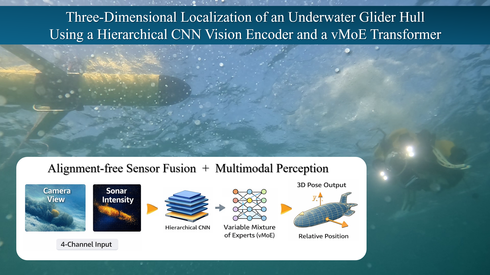 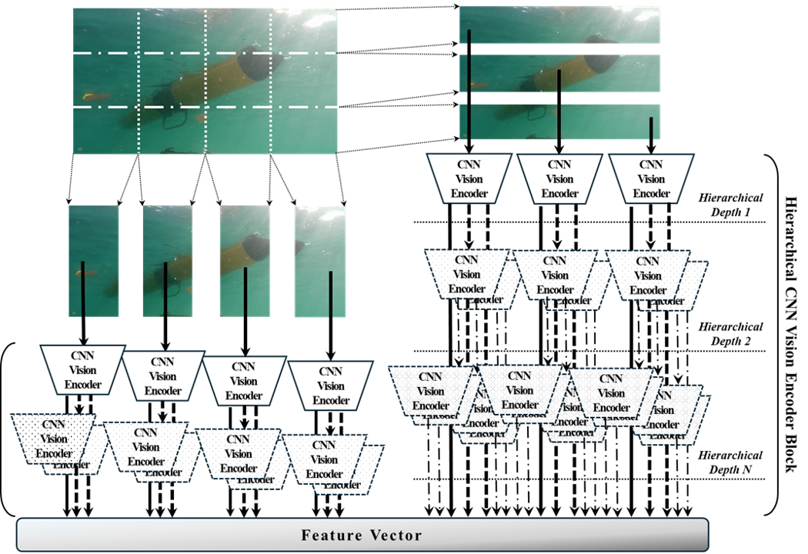 

- #### VLA Training : 2026 ~ 진행 중
  - DROID Dataset을 증강(Depth 생성과 context 추가)하여, VLM(Gemma or Qwen) 모델에 대한 PEFT + Custom Head 로 학습 진행 (Torch)
 
- #### Local Model Fine-tuning : 2026 ~ 진행 중
  - 여러 Local Model의 추론 실행 속도 향상과 특정 도메인이 주어졌을 때의 최적화를 목표로 함
  - Model에 대한 Multi-Modal Encoder Hub, Backbone layers에 대한 동적 라우팅과 PEFT (FFN or MoE), Custom Head 에 대한 시험 진행 

- #### Embedded-AI/Edge-AI 를 위한 자원 제한된 하드웨어 적응형 동적 신경망 설계 연구 : 2026 ~ 진행 중
  - 하드웨어 자원 제한(전력, 처리능력)된 경우 모델 추론을 조절하는 동적 신경망 구현
  - YOLO26 기반 Dynamic Neural Network (Early Exit, Adaptive Routing) 적용 연구 진행 (5월 중 논문 제출 예정)
  - YOLO26 Detector (Small) 모델에서, GFLOPs를 17.32% 감소(mAP 능력은 baseline 대비 101% 유지)
  - 경량 LLM(Nenotron, Gemma4)에 대한 적용 구현도 진행 중
  - 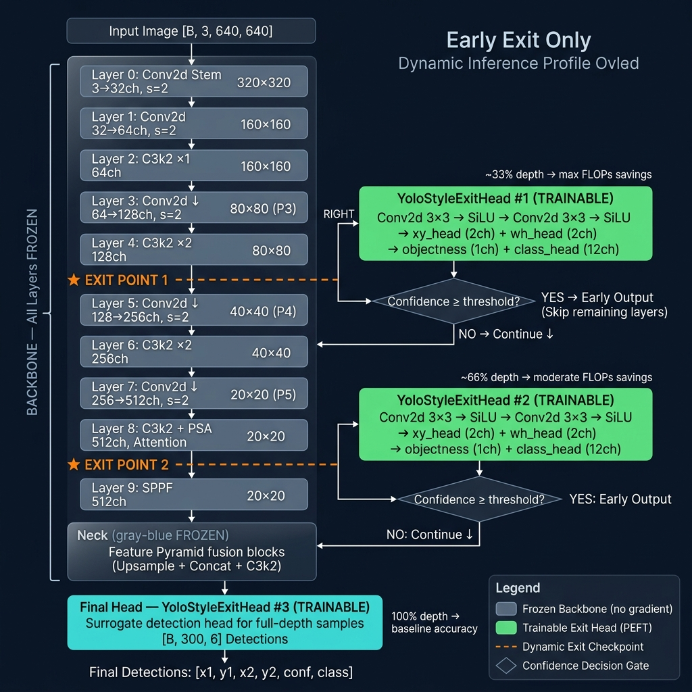 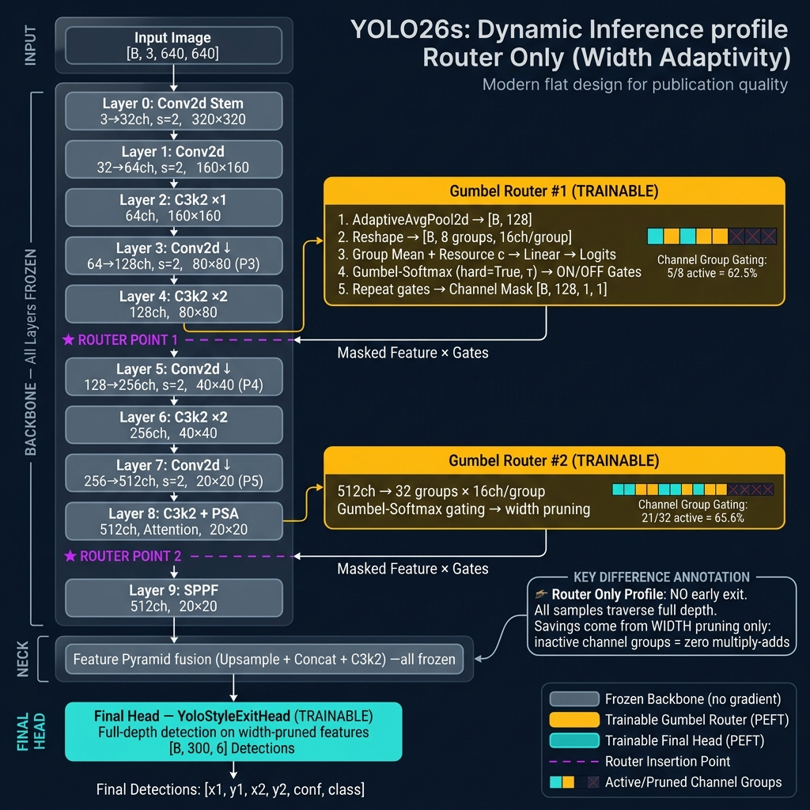 

- #### Embedded-AI/Edge-AI 를 위한 모델 경량화 설계 연구 : 2026 ~ 진행 중
  - 모델 추론 능력을 최대한 유지하면서 레이어 단위로 경량화하여 추론 시간을 단축하는 설계 구현
  - YOLO26 Detector (Large) 모델에서, GFLOPs를 78.26% 감소(mAP는 baseline 대비 80% 유지)
  - 학습 자원 제한으로 현재 YOLO26 Detector 에 대한 구현 진행 중이며, 이후 경량 LLM(Gemma4, Qwen3.5, Nenotron3 Nano)으로 적용 범위 확대

### 2025
- #### Dishware Pose Estimation : 2024 ~ 2025
  - 식당에서 식기 수거를 위한 로봇의 식기 인식을 위한 자세 추정 모델 개발 (Tensorflow, from scratch)
  - Encoder-only Transformer (Custom Attention, MoE) 설계 적용
  - 모델 입력은 카메라의 Color 및 Depth image, 모델 출력은 식기의 6D-Pose + Size + ID로 구성
  - 추론은 NUC15(Intel Ultra7)에서 Intel Graphics 가속으로 ONNX 실행하며, 정확도에 따라 약 8 FPS(낮은 정확도), 5 FPS(중상 정확도), 2 FPS(높은 정확도)의 프로파일을 가짐
  - 약 600mm 거리에서 5° 5㎜ 이내 오차로 식기 자세 추정
  - __["Model-Free Transformer Framework for 6-DoF Pose Estimation of Textureless Tableware Objects"](https://www.mdpi.com/1424-8220/25/19/6167)__ (2024년 결과)
  - 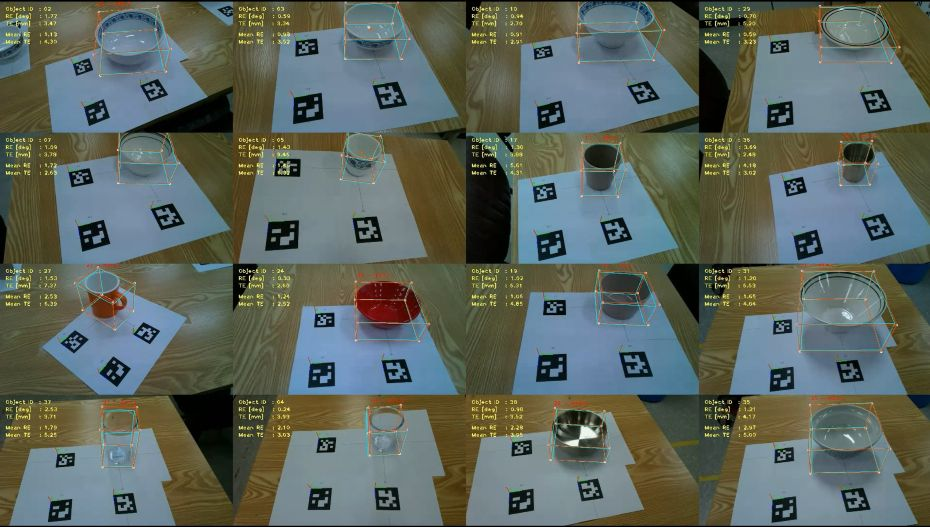  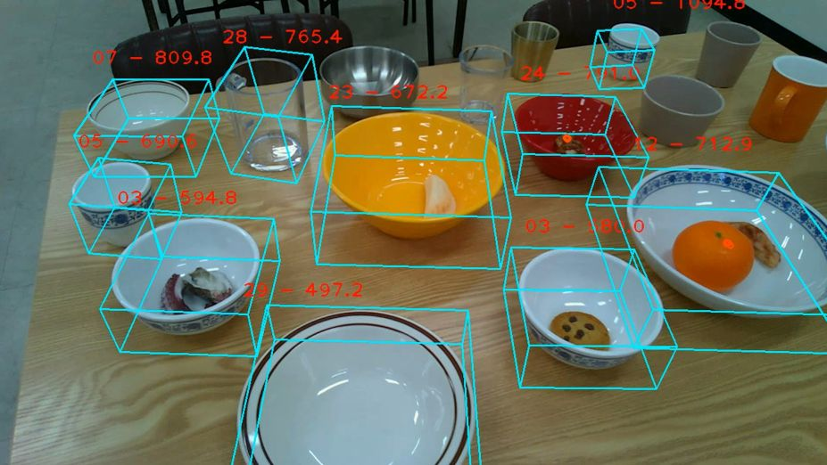 

- #### 객체 포즈 추정을 위한 Transformer Model 개선 : 2025
  - 객체의 Point-Cloud로부터 포즈 추정을 위한 Encoder-only Transformer Model에 대한 성능 개선 목표
  - Transformer Model 내부의 Attention 구조 변형과 GQA, RMS Norm의 적용 등에 대한 Ablation study 비교하고, GPU 메모리 사용량을 baseline model 대비 2.5%로 감소
  -  __["A Study on Systematic Improvement of Transformer Models for Object Pose Estimation"](https://www.mdpi.com/1424-8220/25/4/1227)__

### ~ 2024
- #### 수중글라이더 탐지 모델 개발
  - 수중글라이더 회수 플랫폼(ROV)에서 회수고리 탐지, 글라이더 탐지, ROV 자세유지 모델 개발 (Tensorflow, from scratch)
  - 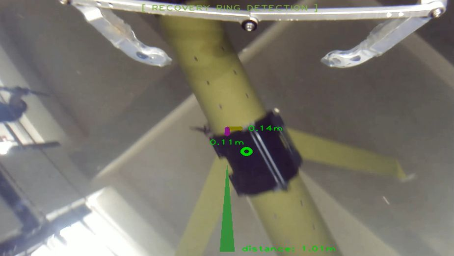 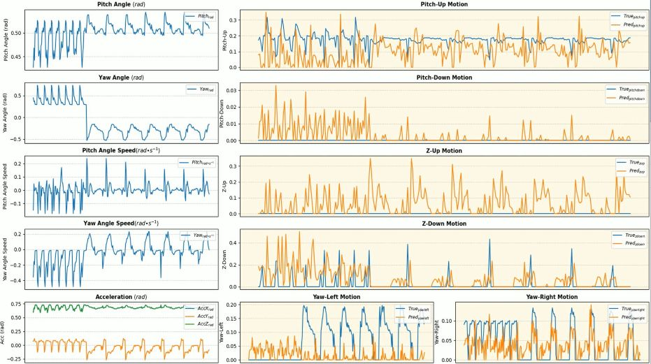 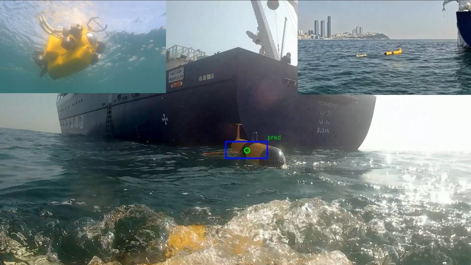

- #### 멀티모달 센서에 의한 실내 위치 추정 모델 개발
  - 멀티모달 센서(Color, IR, Depth image & LiDAR) 데이터 기반의 실내 위치추정 모델 개발 (MobileNet Transfer Learning)
  - 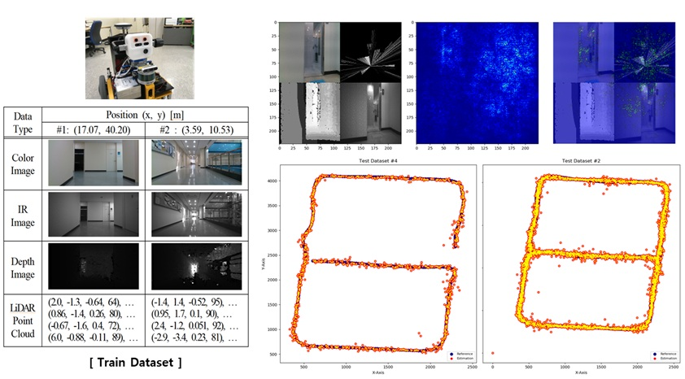
  
- #### 천장 영상 기반 실내 위치 추정 모델 개발
  - 단안 그레이스케일의 천장 영상으로부터 실내 위치를 추정하는 모델 개발 (Tensorflow, from scratch)
  - Intel ReanSense T265 카메라의 Left grayscale image에 대해 Custom Vision Encoder + Head 로 모델 구성
  - 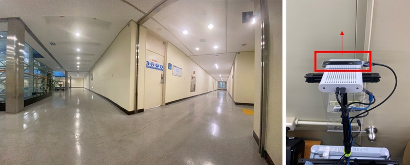 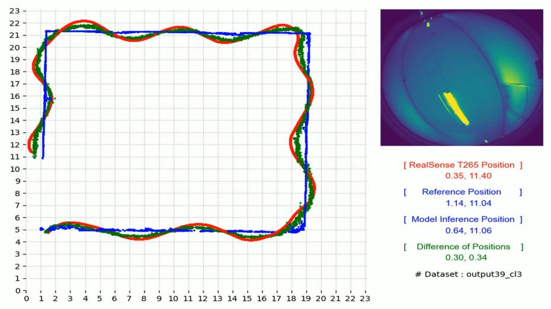 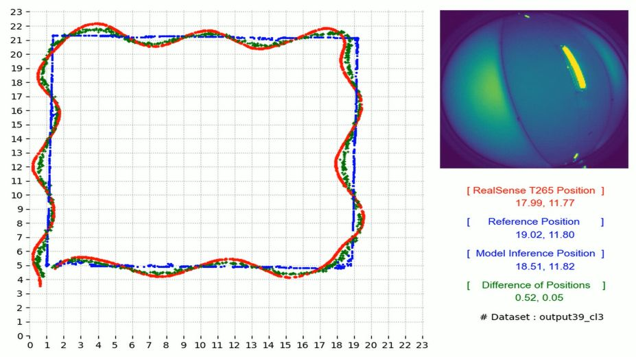

- #### 주차로봇 운용 서버 및 시뮬레이터 개발
  - 다수 주차로봇을 배치하여 운용하기 위한 로컬 서버 및 시뮬레이터 개발 (C#, Python)
  - 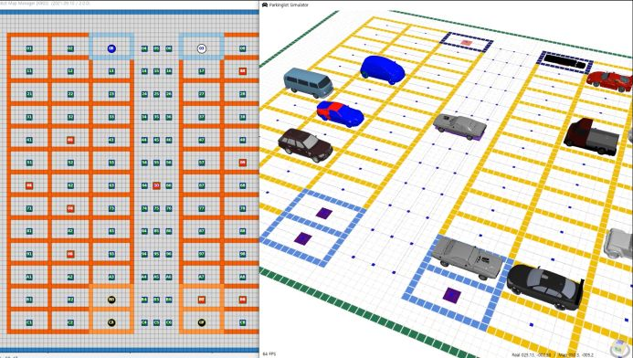 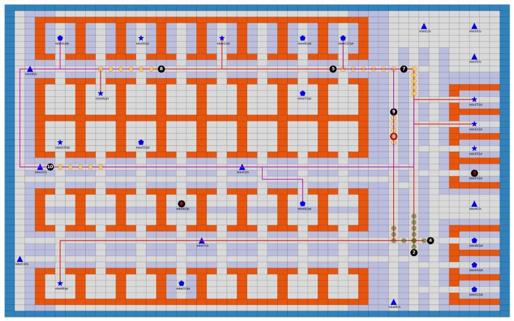

- #### 마찰교반 용접 장비 고장 예지 모델 개발
  - 용접장비의 모터 및 센서 데이터를 바탕으로, 인자 분석을 통한 Feature Engineering 후 RNN 기반 모델 개발 (Tensorflow, from scratch)
  - 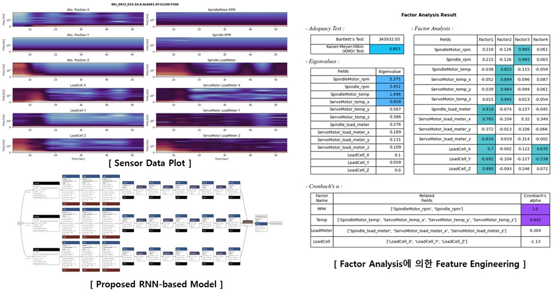

<!-- ### Footer

Last updated: 2026 -->
